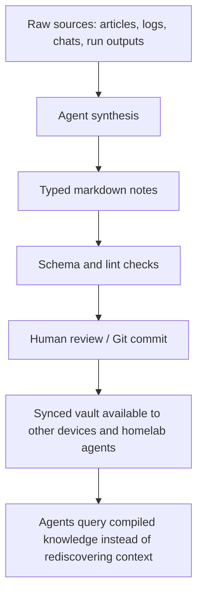

# LLM Wiki Second Brain

> Goal: make this vault a local-first, agent-maintained knowledge base for homelab operations, projects, incidents, and reusable decisions.

## Why This Exists
The current vault is already useful as context for AI sessions, but it is still mostly human-maintained documentation. The next step is an LLM wiki: agents can ingest sources, compile durable notes, update indexes, create links, and preserve operational memory across sessions and machines.

This should not mean unbounded autonomy. It should mean controlled autonomy: agents can read broadly, propose changes freely, and write through schema-checked conventions with clear source-of-truth rules.

## Target Architecture

## Design Principles
- Local-first: markdown files remain the durable source.
- Tailscale-first: coded service connections should use Tailscale IPs or MagicDNS.
- GitOps-friendly: durable infrastructure changes should land in repos/playbooks, not only in notes.
- Typed notes: every durable wiki note should declare what kind of thing it is.
- Semantic links: prefer explicit relationship sections over vague "related" links.
- Validated writes: agents should follow templates and run lint/checks before declaring the vault updated.
- Human-controlled autonomy: agents can maintain the wiki, but high-risk infrastructure and guest-facing changes still need deliberate review.

## Current State
- Root agent files exist: [[CLAUDE]] and [[AGENTS]].
- Homelab docs exist: [[Resources/AI Operating Guide]], [[Resources/Host Inventory]], [[Resources/Service Catalog]], [[Resources/Network Map]].
- Obsidian plugins present locally include LiveSync, Local REST API, Smart Connections, Linter, Tasks, Dataview, Obsidian Git, and Remotely Save.
- Native Obsidian CLI was not found on PATH during the 2026-05-12 check.
- Sync to other devices/hardware is not yet reliable enough to treat every homelab agent as having the latest vault.

## Folder Model
| Folder | Purpose |
|--------|---------|
| `Sources/Raw/` | Unprocessed captures, copied articles, command outputs, exported chats. |
| `Sources/Articles/` | Article captures and web research notes. |
| `Wiki/Infrastructure/` | Stable notes about hosts, services, networks, and integrations. |
| `Wiki/Concepts/` | Reusable ideas, patterns, and concepts. |
| `Wiki/Decisions/` | ADR-style architecture and operations decisions. |
| `Wiki/Incidents/` | Outages, failures, root causes, and lessons learned. |
| `Logs/` | Agent session logs and ingestion logs. |
| `Schemas/` | Ontology, conventions, and validation rules for agents. |
| `Templates/` | Note templates agents should copy before writing durable wiki pages. |

## Agent Capabilities To Build
- `/wiki-ingest <source>`: read a source, extract durable concepts, create typed notes, update links.
- `/wiki-query <question>`: answer from the vault with links to source notes and uncertainty called out.
- `/wiki-health`: find orphaned links, missing frontmatter, stale inventories, and contradictory host/service facts.
- `/service-add <name>`: create or update service docs, GitOps repo pointers, monitoring expectations, and runbook entries.
- `/incident-log 
`: capture an outage/debrief and link it to affected hosts/services.

## Implementation Plan
- [x] Create project note and initial schema docs.
- [x] Create typed note templates for wiki, ADR, and incident records.
- [ ] Decide automation bridge: Obsidian native CLI, Local REST API plugin, or both.
- [ ] Establish vault sync target for other devices/hardware agents.
- [ ] Add a lightweight validation script for required frontmatter and broken wikilinks.
- [ ] Convert existing host/service docs into typed wiki notes where useful.
- [ ] Add Dataview indexes for hosts, services, decisions, and incidents.
- [ ] Define Git workflow for agent-written vault changes.
- [ ] Connect homelab MCP/agents so natural-language service additions update docs and repos safely.

## Open Questions
- Should Obsidian LiveSync remain the main sync path, or should this vault also be pushed to GitHub/Gitea for agent consumption?
- Should agents write directly to the vault, or stage changes in a branch / review folder first?
- Which machine should run scheduled wiki health checks?
- Should service source-of-truth repos live under one homelab IaC repo, or per-host repos?

## Related
[[Home]] · [[Schemas/LLM Wiki Schema]] · [[Schemas/Relationship Ontology]] · [[Resources/AI Operating Guide]] · [[Resources/Runbooks]]
